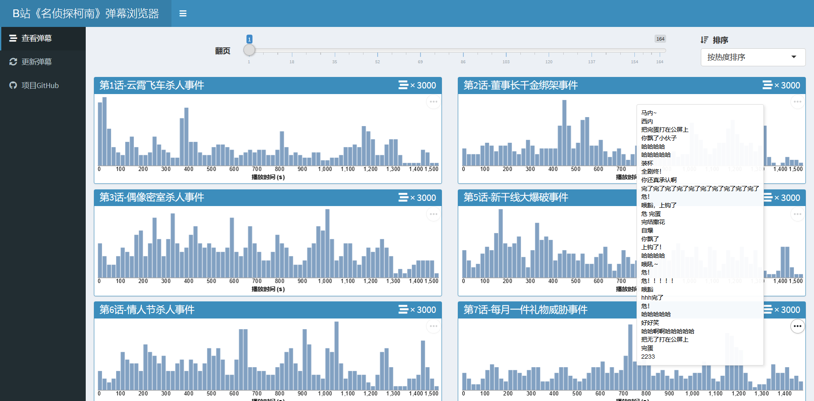

最近B站一次性更新了快1000集《[名侦探柯南](https://www.bilibili.com/bangumi/play/ep321808)》，这个 [R Shiny App](https://shiny.rstudio.com/) 可以帮助你筛选出最热门的剧集（以弹幕数量排序），同时预览弹幕在时间轴上的分布，类似于官方的高能进度条。用鼠标划过柱状图时，会显示该时间段（长度为20秒）的弹幕（最多100条）。效果图如下：



运行本 Shiny App 的方法：

```r
source("01_fetch_data.R")
source("02_clean_data.R")
shiny::runApp("conan-danmu")
```

预览页面：https://yixuanq.shinyapps.io/conan-danmu/

注意事项：

1. 显示的弹幕并非实时，而是预先抓取缓存下来的。
2. B站对实时弹幕的数量有限制，通常最多为3000条，因此有些剧集虽然已经有上万条弹幕，但也只显示3000条。
3. 抓取的代码包含在 `01_fetch_data.R` 和 `02_clean_data.R` 两个文件中，如果不要求实时更新，基本只需要跑一遍，然后就可以运行 Shiny App 了。
4. 抓取弹幕数据时请遵守技术道德，不要在短时间内提交大量请求。
5. 我的 [Shinyapps.io](https://www.shinyapps.io/) 账号是免费版的，运行时长有限，有可能某些时候无法访问，属正常情况。😂
6. ~~这不是用来平时摸鱼~~这是用来学习网站数据抓取和可视化的一个项目。
